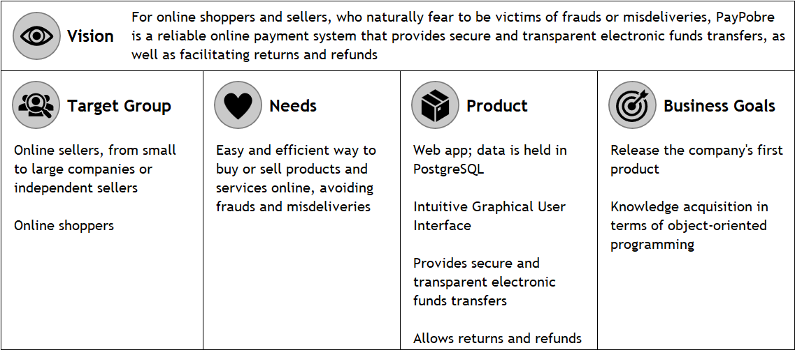

---

- _Who is the target audience?_

  PayPobre's target audience are online shoppers and sellers, from small to large companies or independent sellers.
- _Which customer needs can the product satisfy?_

  PayPobre is a easy and efficient way to buy or sell products and services online, avoiding frauds and misdeliveries.
- _Which product attributes determine the satisfaction of those needs?_

  PayPobre is a web app that provides secure and transparent eletronic funds transfers, as well as facilitating returns and refunds. Its intuitive Graphical User Interface makes this online payment system extremely easy to use, even for beginners.
- _Who is competing and how do they perform?_

  There are many competitors in this market, such as PayPal, Amazon Pay, Apple Pay or Google Pay, each of them having millions of users and billions of dollars in revenue in the last year.
- _What timeframe and product development budget determine the project?_\
  The project must be completed by the end of the semester. As it is a university project, there is no associated budget.