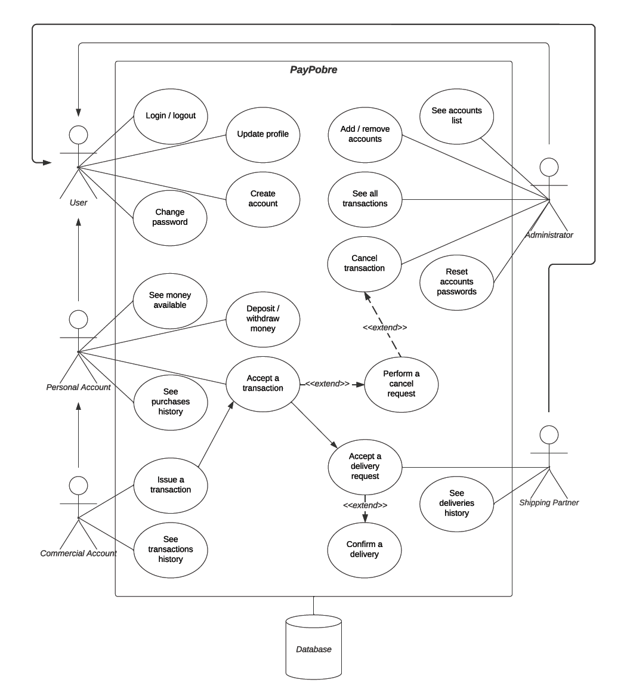

---

| Sign up a new user |
|--------------------|
| 1. PayPobre asks to create a new user account |
| 2. New user selects account type |
| 3. New user introduces account details |
| 4. New user’s details are verified (credit card, e-mail…) |
| 5. New user created |

| Log in |
|--------|
| 1. User inputs e-mail/User ID and password |
| 2a. Password or e-mail are incorrect |
| 3a. Go back to log in page |
| 2b. User e-mail and password are correct |
| 3b. Log in done |

| Transaction |
|-------------|
| 1. Commercial account asks to do a transaction, addressing the respective information |
| 2. Personal account accepts the transaction |
| 3a. Personal account performs a cancel request |
| 4a. If the reason is valid and the conditions are meet, the administrator cancels the transaction |
| 3b. Shipping partner accepts and confirms the delivery request |
| 4b. Transaction done |
