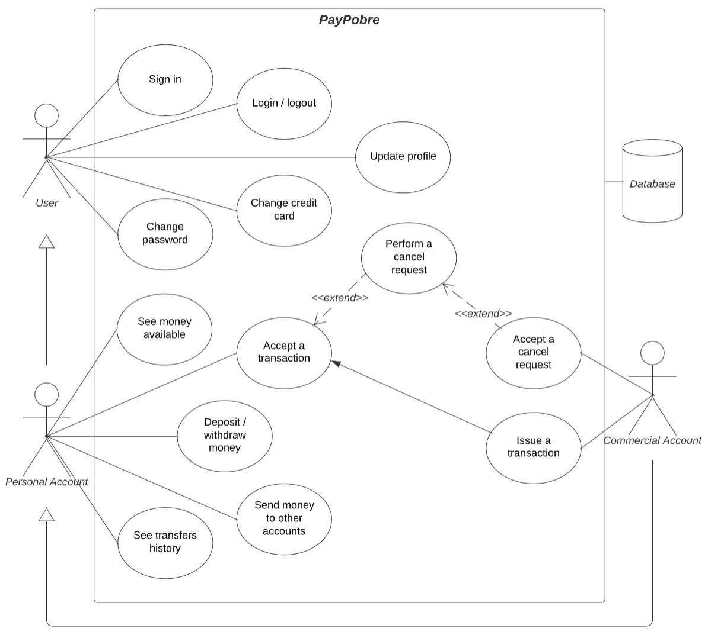

---

| Sign in |
|---------|
| PayPobre asks to create a new user account |
| New user selects account type and introduces account details (name, email, password, credit card) |
| a. New user's details are empty or invalid |
| a. Go back to sign up page |
| b. New user’s details and contacts are valid |
| b. New user created |

| Log in (pre-requisite: valid user account) |
|--------------------------------------------|
| User inputs email and password |
| a. Password or email are empty or incorrect |
| a. Back to login page |
| b. User email and password are correct |
| b. Login done |

| Transaction (pre-requisite: buyer logged in with personal acc. and seller logged in with commercial acc.) |  |
|-----------------------------------------------------------------------------------------------------------|--|
| Commercial account issues a transaction, addressing the respective information |  |
| a. Personal account cancels the transaction |  |
| b. Personal account accepts the transaction |  |
| b1. Personal account performs a cancel request |  |
| b1. If the reason is valid and the conditions are meet, the commercial account accepts the cancel request |  |
| b2. Transaction done |  |

| Update Profile (pre-requisite: logged in with valid user account) |
|-------------------------------------------------------------------|
| User goes to Profile page |
| User hits "Update Profile" button |
| User fills in the fields "New name" and/or "New email" and "Confirm Password" |
| a. If something is wrong, the name and/or email remain unchanged |
| b. Name and/or email changed successfully |

| Change Credit Card (pre-requisite: logged in with valid user account) |
|-----------------------------------------------------------------------|
| User goes to Profile page |
| User hits "Change Credit Card" button |
| User fills in the fields "New Credit Card" and "Confirm Password" |
| a. If something is wrong, credit card remains unchanged |
| b. Credit card changed successfully |

| Change password (pre-requisite: logged in with valid user account) |
|--------------------------------------------------------------------|
| User goes to Profile page |
| User hits "Change Password" button |
| User fills in the fields "Old Password", "New Password" and "Confirm Password" |
| a. If something is wrong, password remains unchanged |
| b. Password changed successfully |

| Deposit/withdraw money (pre-requisite: logged in with valid user account) |
|---------------------------------------------------------------------------|
| User goes to Profile page |
| User inserts amount to deposit/withdraw |
| a. If something is wrong, an error message appears and no money is moved |
| b. Money deposited/withdrew successfully |

