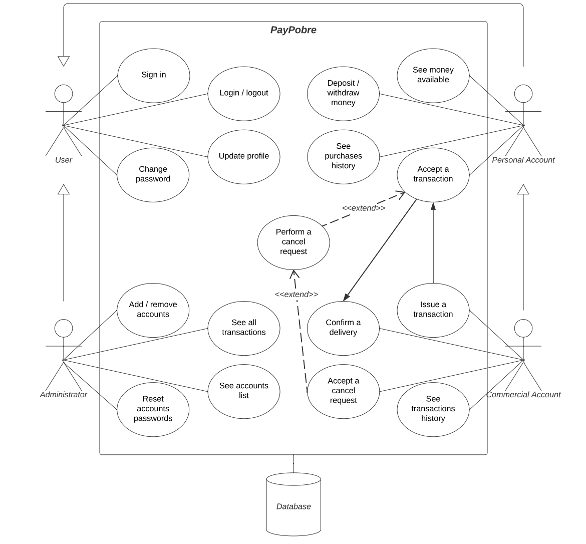

---

| Sign in |
|---------|
| 1. PayPobre asks to create a new user account |
| 2. New user selects account type and introduces account details (name, email, password, credit card) |
| 3a. New user's details are empty or invalid |
| 4a. Go back to sign up page |
| 3b. New user’s details and contacts are valid |
| 4b. New user created |

| Log in (pre-requisite: valid user account) |
|--------------------------------------------|
| 1. User inputs email and password |
| 2a. Password or email are empty or incorrect |
| 3a. Go back to login page |
| 2b. User email and password are correct |
| 3b. Login done |

| Transaction (pre-requisite: one user logged in with personal acc. and other user logged in with commercial acc.) |
|------------------------------------------------------------------------------------------------------------------|
| 1. Commercial account asks to do a transaction, addressing the respective information |
| 2. Personal account accepts the transaction |
| 3a. Personal account performs a cancel request |
| 4a. If the reason is valid and the conditions are meet, the commercial account accepts the cancel request |
| 3b. Commercial account confirms the delivery |
| 4b. Transaction done |

