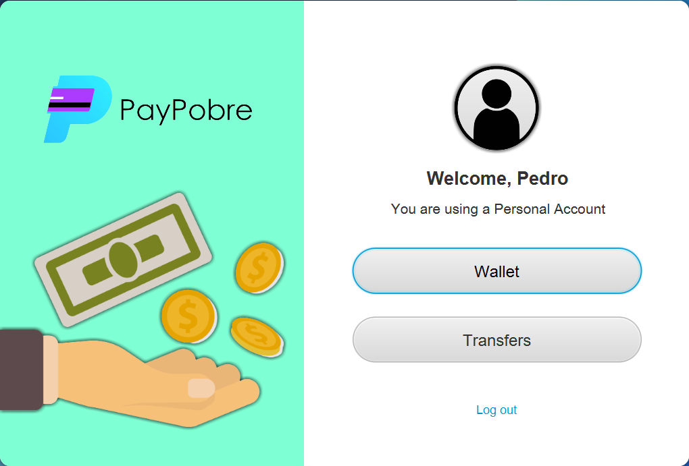
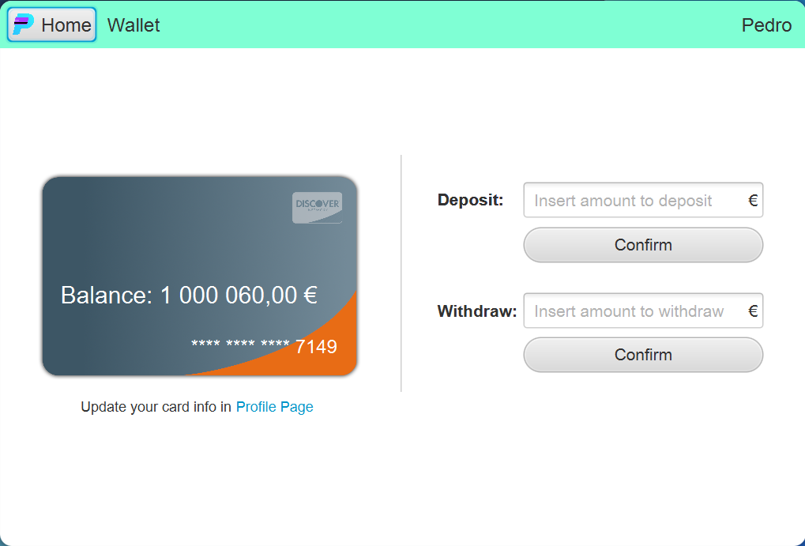
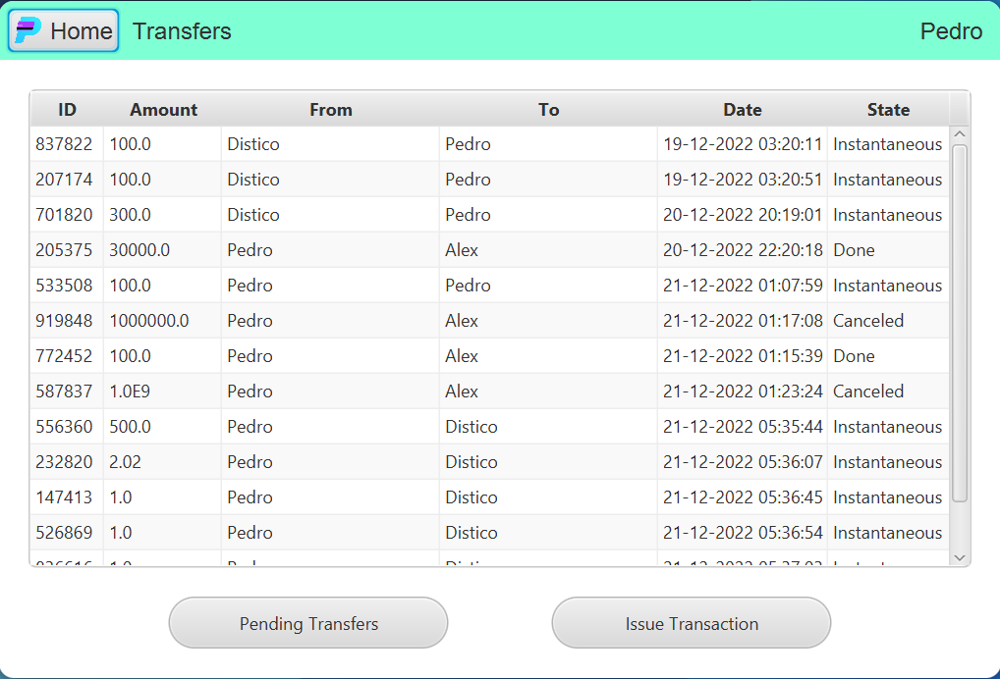
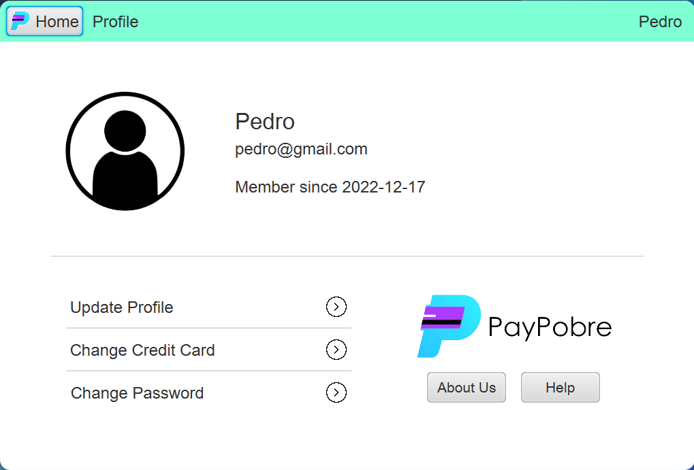

## What is PayPobre

PayPobre is a web app that provides secure and transparent eletronic funds transfers.

## Getting started

Whenever you access PayPobre, you will be welcomed with the Login Page. If this is your first time using the app, you should start by creating an account by pressing the Sign Up hyperlink. Once on this page, choose the type of account you want to use and enter your name, email, password and credit card. There are two types of accounts: Personal Accounts and Commercial Accounts. With a Personal Account, you'll be able to shop online and send money to other users, while a Commercial Accounts also allows you to issue a transaction.

With an account created, you will now be able to login with your email and password and access the PayPobre's Home Page. This page gives access to other three main pages, Wallet, Transfers and Profile, which will be covered in the respective topics below. Besides that, here you can check your account type.

## Wallet

On this page you can check your balance, deposit, and withdraw money in a very intuitive way.

On the left side, you can see your credit card type, displaying your current balance and the last 4 digits of your card number. Furthermore, on the right side, there is the “Deposit Money” field and the “Withdraw Money” field. To use them, just insert the amount you pretend to deposit or withdraw (fulfilling the respective field) and conclude the operation by pressing the respective button.

## Transfers

On the Transfers Page, you will be able to check your transaction history in a table that presents various information regarding the transfers already carried out or to be carried out, namely the ID, the amount involved, the sender, the receiver, the date and the state. The state can have four different values, three related to Commercial Transactions (pending, done and canceled) and the remaining one related to Personal Transactions (instantaneous).

### Pending Transfers

On this pop-up window you can see every transaction waiting for your approval. You can either accept it, if you have enough money, or cancel it.

### Issue Transaction

On this pop-up window you can specify the transaction type you want to perform. If you have a Commercial Account you can opt between "Send Money" or "Commercial Transaction", whereas in a Personal Account you can only "Send Money". After that, you can specify the amount and the email of the receiver or buyer, depending on the transation type.

## Profile

On the Profile Page, you will be able to see your profile information, as well as update your profile (name and email), password and credit card. Pressing any of these buttons will open a pop-up window, with some fields to fill in with what you want to update and one more field to confirm the password.

Finally, there are two more buttons: About Us, which gives access to a small presentation about the project's creators, and Help, where support contacts can be found.

